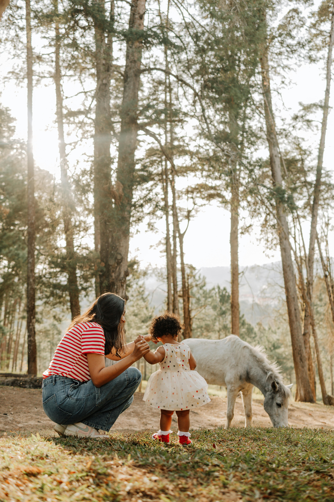
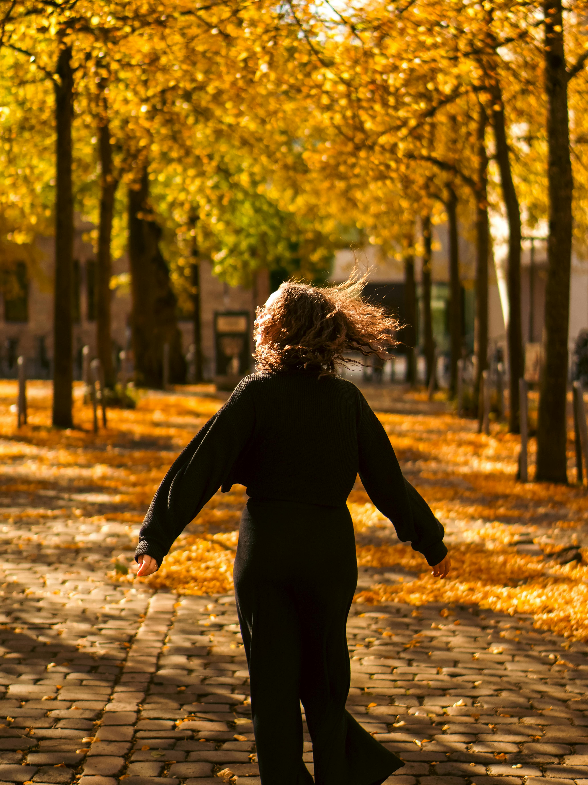
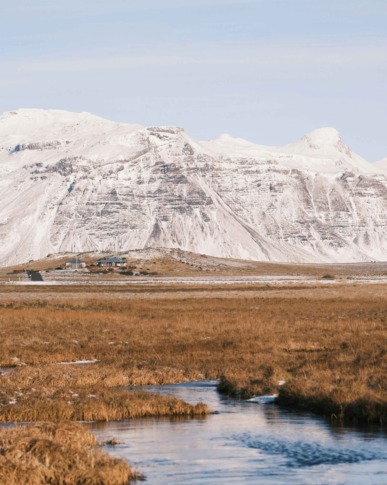
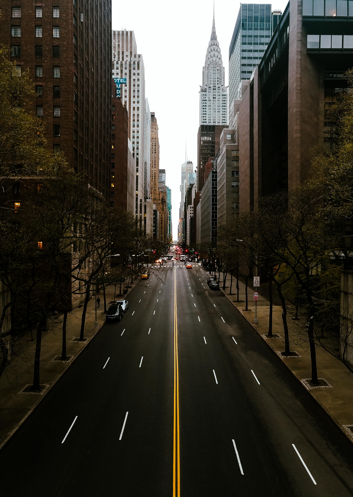

# Episode 1 - How Not To Start A Writing Project
## Writing Exercise: Picturesque Writing
### Writing:

#### Jade:
The horse, which was quite used to having humans around it, didn’t like that she was being watched by this small child. There was something about the movement of the dress, the bright colours, the red shoes, that made her nervous. Adults were predictable, they could be kind, or they could be monsters but usually they were one or the other. Children on the other hand were so quick to switch that they made no sense, they’d be kind, offering food and being gentle, one minute. Then the next minute they would be cruel, biting, pinching, devils and often there would be no way of knowing which they would be in any given moment. Understandably this made the horse nervous and as the child got a little closer the horse lifted its head and moved off deeper into the forest.

#### Alice:
He stood behind the camera as he watched his wife and child walk towards the pony. It was a sweet looking pony in all honesty. Looked somewhat friendly and the staff had assured him that it was gentle and that his child would be safe. His little one was only about 3 and it was the first time she was meeting a pony. They had taken a long drive in order to visit the farm and meet different animals. As city people the only creatures they saw regularly were the fat rats and stupid dogs on leads. Therefore, a pony was quite special.

#### Jade:
Wind, the chill of it as it brushes your hair aside and lifts the leaves from the floor, is one of the few ways to convince yourself that you are still alive. The movement of the trees and the rustle as the air drifts through them is calming in a way that would be impossible to describe to someone who has never experienced it. As she walked along the cobbled path and spread her arms she tried desperately to convince herself that she was still alive. And yet through all of this she didn’t feel it. She pulled air into her lungs but it didn’t feel like she was breathing to keep herself alive. It felt like she was breathing to not be dying, and if you don’t understand the difference between those two. Count yourself lucky.

#### Alice:
She walked down the avenue of trees. The autumn light glinting a pale yellow and orange as it shone through the fading leaves of the trees. She has Autumn had never been her favourite season before, preferring spring and its new beginnings rather than the signs of dying and sleep that Autumn had. But this autumn was special. For her it would signify the end of a chapter in her life. A painful one with hard memories that one day she will look back on with little care for the people she was saying goodbye to now. For the moment, the trees and fallen leaves accompanied her.

#### Jade:
It was a beautiful day at the research station, there was always something quiet about the place. The research was never frantic or rushed as what about the marshland would change so rapidly. Each day Lily would wander the marsh in her muck boots and try to find something interesting to include in her report. She’d settled on this routine a long time ago and enjoyed making sure that each report was different enough that her days didn’t blur together. Life here was content and though the mountain behind was often seen as imposing, she preferred to think of it as protective.

#### Alice:
The mountains appear to be lonely places. Especially the ones with snow as they are so beautiful to look at from a distance, but harsh when actually in them. But if you listen to the stories told to you by people who live at the base of such mountain you might learn that there are beings in them that are right out a story book. The people who live near these mountains are the kind of people who leave honey out for the Fae folk and talk to their beehives about their families and lives. These superstitions are strange, but perhaps they hold a truth.

#### Jade:
The City stretched on endlessly, rows and rows of buildings that were never really given a purpose other than the backdrops for the stories the City liked to see play out. A newcomer to the place wouldn’t believe you, at least for the first few days, if you told them that the City wouldn’t let you leave but she knew better. The City liked to watch, voyeuristic and cruel, as you tried to escape because it always knew it could pull the rug out from under you and around the next bend you’d find yourself back in the centre. The only way to survive this place was to find a story to be a part of. If the City ever grew bored of you you’d find yourself forgotten, and she knew that being forgotten was the only thing worse than being trapped.

#### Alice:
It’s a strange place to be, standing in the middle of the road in a city. Most people would stay to the pavements and designated crossing. But sometimes its important to stand in the middle of the road. You can look at a city from a different point of view. And perhaps you will see the secrets that it is hiding. That in the reflections on windows there are faces that don’t belong to the occupants behind them. That if you’re lucky, or perhaps unfortunate, you will see the shadows that peak out from flickering city lights watching you back.

## Other Links
-
